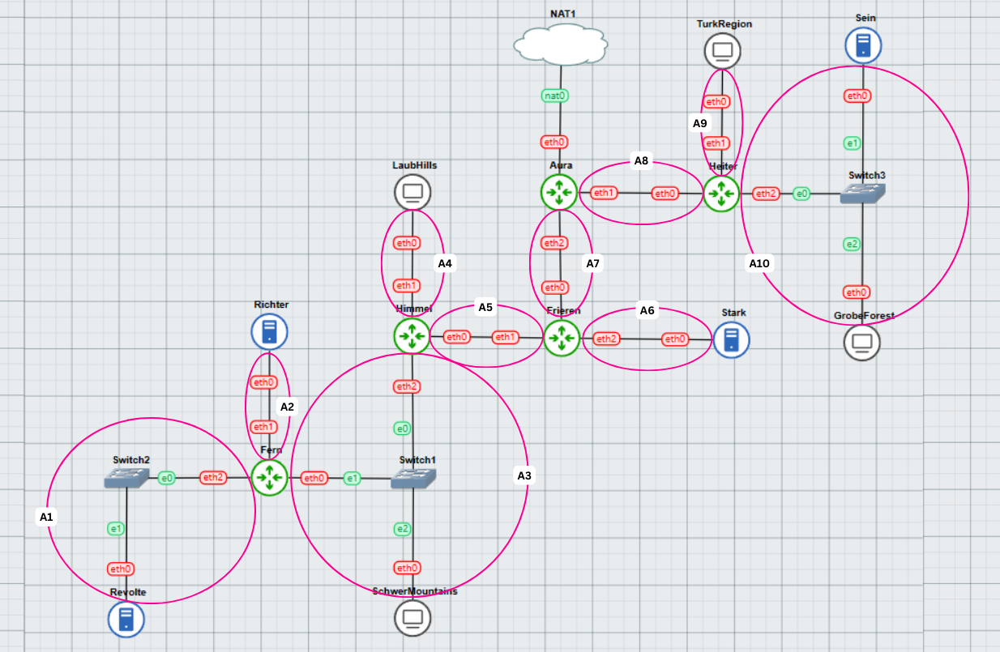
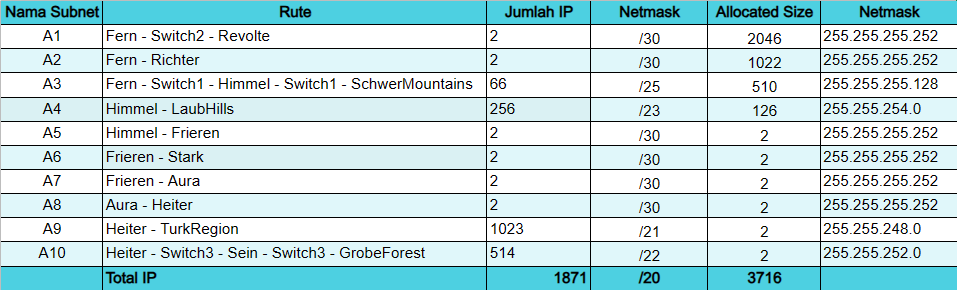
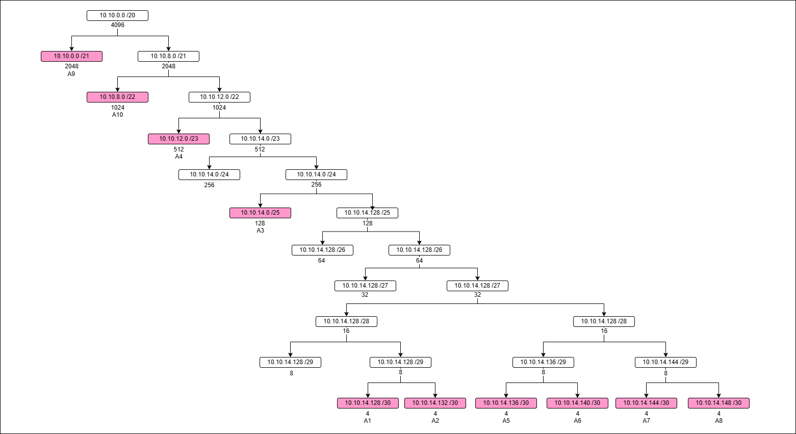

# Jarkom-Modul-5-B03-2023
Berikut adalah laporan resmi untuk praktikum modul 5 jarkom.

| Nama | NRP |
|---------------------------|------------|
|Wan Sabrina Mayzura | 5025211023 |
|Syarifah Talitha Erfany | 5025211175 |

## Daftar Isi
  - [Topologi dan Pembagian Subnet](#topologi-dan-pembagian-subnet)
  - [Rute](#rute)
  - [Tree](#tree)
  - [Config GNS3](#config-gns3)
  - [Pembagian IP](#pembagian-ip)
  - [Routing](#routing)
  - [Testing](#testing)

## Topologi dan Pembagian Subnet


## Rute


## Tree


## Config GNS3

- Aura (Router)
```
auto eth0
iface eth0 inet dhcp

auto eth1
iface eth1 inet static
	address 10.10.14.149
	netmask 255.255.255.252

auto eth2
iface eth2 inet static
	address 10.10.14.145
	netmask 255.255.255.252
```

- Heiter (Router)
```
auto eth0
iface eth0 inet static
	address 10.10.14.150
	netmask 255.255.255.252
	gateway 10.10.14.149

auto eth1
iface eth1 inet static
    address 10.10.0.1
    netmask 255.255.248.0

auto eth2
iface eth2 inet static
    address 10.10.8.1
    netmask 255.255.252.0
```

- TurkRegion (Client)
```
auto eth0
iface eth0 inet dhcp
```

- Sein (Server)
```
auto eth0
iface eth0 inet static
	address 10.10.8.2
	netmask 255.255.252.0
	gateway 10.10.8.1
```

- GrobeForest (Client)
```
auto eth0
iface eth0 inet dhcp
```

- Frieren (Router)
```
auto eth0
iface eth0 inet static
	address 10.10.14.146
	netmask 255.255.255.252
	gateway 10.10.14.145

auto eth1
iface eth1 inet static
    address 10.10.14.137
    netmask 255.255.255.252

auto eth2
iface eth2 inet static
    address 10.10.14.141
    netmask 255.255.255.252
```

- Stark (Server)
```
auto eth0
iface eth0 inet static
	address 10.10.14.142
	netmask 255.255.255.252
	gateway 10.10.14.141
```

- LaubHills (Client)
```
auto eth0
iface eth0 inet dhcp
```

- Himmel (Router)
```
auto eth0
iface eth0 inet static
	address 10.10.14.138
	netmask 255.255.255.252
	gateway 10.10.14.137

auto eth1
iface eth1 inet static
    address 10.10.12.1
    netmask 255.255.254.0

auto eth2
iface eth2 inet static
    address 10.10.14.1
    netmask 255.255.255.128
```

- Fern (Router)
```
auto eth0
iface eth0 inet static
	address 10.10.14.2
	netmask 255.255.255.128
	gateway 10.10.14.1

auto eth1
iface eth1 inet static
    address 10.10.14.133
    netmask 255.255.255.252

auto eth2
iface eth2 inet static
    address 10.10.14.129
    netmask 255.255.255.252
```

- Richter (Server)
```
auto eth0
iface eth0 inet static
	address 10.10.14.134
	netmask 255.255.255.252
	gateway 10.10.14.133
```

- SchwerMountains (Client)
```
auto eth0
iface eth0 inet dhcp
```

- Revolte (Server)
```
auto eth0
iface eth0 inet static
	address 10.10.14.130
	netmask 255.255.255.252
	gateway 10.10.14.129
```

## Pembagian IP
Sesuai config network, maka pembagian IP untuk tiap nodenya adalah sebagai berikut:
| Node               | Subnet | Interface | IP Address    | Netmask         | Gateway        |
|--------------------|--------|-----------|---------------|-----------------|----------------|
| Aura (Router)      |   -    | eth0      | DHCP          | -               | -              |
|                    |   A8   | eth1      | 10.10.14.149  | 255.255.255.252 | -              |
|                    |   A7   | eth2      | 10.10.14.145  | 255.255.255.252 | -              |
| Heiter (Router)    |   A8   | eth0      | 10.10.14.150  | 255.255.255.252 | 10.10.14.149   |
|                    |   A9   | eth1      | 10.10.0.1     | 255.255.248.0   | -              |
|                    |  A10   | eth2      | 10.10.8.1     | 255.255.252.0   | -              |
| TurkRegion         |   A9   | eth0      | DHCP          | -               | -              |
| Sein (Server)      |  A10   | eth0      | 10.10.8.2     | 255.255.252.0   | 10.10.8.1      |
| GrobeForest        |  A10   | eth0      | DHCP          | -               | -              |
| Frieren (Router)   |   A7   | eth0      | 10.10.14.146  | 255.255.255.252 | 10.10.14.145   |
|                    |   A5   | eth1      | 10.10.14.137  | 255.255.255.252 | -              |
|                    |   A6   | eth2      | 10.10.14.141  | 255.255.255.252 | -              |
| Stark (Server)     |   A6   | eth0      | 10.10.14.142  | 255.255.255.252 | 10.10.14.141   |
| LaubHills (Client) |   A4   | eth0      | DHCP          | -               | -              |
| Himmel (Router)    |   A5   | eth0      | 10.10.14.138  | 255.255.255.252 | 10.10.14.137   |
|                    |   A4   | eth1      | 10.10.12.1    | 255.255.254.0   | -              |
|                    |   A3   | eth2      | 10.10.14.1    | 255.255.255.128 | -              |
| Fern (Router)      |   A3   | eth0      | 10.10.14.2    | 255.255.255.128 | 10.10.14.1     |
|                    |   A2   | eth1      | 10.10.14.133  | 255.255.255.252 | -              |
|                    |   A1   | eth2      | 10.10.14.129  | 255.255.255.252 | -              |
| Richter (Server)   |   A2   | eth0      | 10.10.14.134  | 255.255.255.252 | 10.10.14.133   |
| SchwerMountains (Client) |   A3   | eth0 | DHCP          | -               | -              |
| Revolte (Client)   |   A1   | eth0      | 10.10.14.130  | 255.255.255.252 | 10.10.14.129   |

## Routing

- Aura
```shell
# ke arah Frieren
# gateway menggunakan eth0 dari Frieren

# ke arah Heiter
# gateway menggunakan eth0 dari Heiter
```

- Frieren
```shell
route add -net 10.10.14.128 netmask 255.255.255.252 gw 10.10.14.138
route add -net 10.10.14.132 netmask 255.255.255.252 gw 10.10.14.138
route add -net 10.10.14.0 netmask 255.255.255.128 gw 10.10.14.138
route add -net 10.0.12.0 netmask 255.255.255.0 gw 10.10.14.138
```

- Himmel
```shell

```