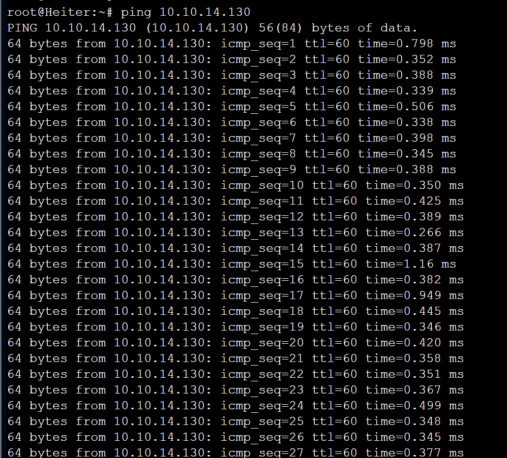

# Jarkom-Modul-5-B03-2023
Berikut adalah laporan resmi untuk praktikum modul 5 jarkom.

| Nama | NRP |
|---------------------------|------------|
|Wan Sabrina Mayzura | 5025211023 |
|Syarifah Talitha Erfany | 5025211175 |

# Daftar Isi
- [Persiapan](#persiapan)
  - [Topologi dan Pembagian Subnet](#topologi-dan-pembagian-subnet)
  - [Rute](#rute)
  - [Tree](#tree)
  - [Konfigurasi GNS3](#konfigurasi-gns3)
  - [Pembagian IP](#pembagian-ip)
  - [Routing](#routing)
  - [Konfigurasi Awal](#konfigurasi-awal)
- [Solusi](#solusi)
  - [Number 1](#number-1)
  - [Number 2](#number-2)
  - [Number 3](#number-3)
  - [Number 4](#number-4)
  - [Number 5](#number-5)
  - [Number 6](#number-6)
  - [Number 7](#number-7)
  - [Number 8](#number-8)
  - [Number 9](#number-9)
  - [Number 10](#number-10)


## Topologi dan Pembagian Subnet


## Rute


## Tree


Sesuai perhitungan VLSM pembagian IP untuk tiap subnet adalah sebagai berikut:


## Konfigurasi GNS3

- Aura (Router)
	```
	auto eth0
	iface eth0 inet dhcp

	auto eth1
	iface eth1 inet static
		address 10.10.14.149
		netmask 255.255.255.252

	auto eth2
	iface eth2 inet static
		address 10.10.14.145
		netmask 255.255.255.252
	```

- Heiter (Router)
	```
	auto eth0
	iface eth0 inet static
		address 10.10.14.150
		netmask 255.255.255.252
		gateway 10.10.14.149

	auto eth1
	iface eth1 inet static
		address 10.10.0.1
		netmask 255.255.248.0

	auto eth2
	iface eth2 inet static
		address 10.10.8.1
		netmask 255.255.252.0

	up echo nameserver 192.168.122.1 > /etc/resolv.conf
	```

- TurkRegion (Client)
	```
	auto eth0
	iface eth0 inet dhcp
	```

- Sein (Server)
	```
	auto eth0
	iface eth0 inet static
		address 10.10.8.2
		netmask 255.255.252.0
	```

- GrobeForest (Client)
	```
	auto eth0
	iface eth0 inet dhcp
	```

- Frieren (Router)
	```
	auto eth0
	iface eth0 inet static
		address 10.10.14.146
		netmask 255.255.255.252
		gateway 10.10.14.145

	auto eth1
	iface eth1 inet static
		address 10.10.14.137
		netmask 255.255.255.252

	auto eth2
	iface eth2 inet static
		address 10.10.14.141
		netmask 255.255.255.252

	up echo nameserver 192.168.122.1 > /etc/resolv.conf
	```

- Stark (Server)
	```
	auto eth0
	iface eth0 inet static
		address 10.10.14.142
		netmask 255.255.255.252
		gateway 10.10.14.141

	up echo nameserver 192.168.122.1 > /etc/resolv.conf
	```

- LaubHills (Client)
	```
	auto eth0
	iface eth0 inet dhcp
	```

- Himmel (Router)
	```
	auto eth0
	iface eth0 inet static
		address 10.10.14.138
		netmask 255.255.255.252
		gateway 10.10.14.137

	auto eth1
	iface eth1 inet static
		address 10.10.12.1
		netmask 255.255.254.0

	auto eth2
	iface eth2 inet static
		address 10.10.14.1
		netmask 255.255.255.128

	up echo nameserver 192.168.122.1 > /etc/resolv.conf
	```

- Fern (Router)
	```
	auto eth0
	iface eth0 inet static
		address 10.10.14.2
		netmask 255.255.255.128
		gateway 10.10.14.1

	auto eth1
	iface eth1 inet static
		address 10.10.14.133
		netmask 255.255.255.252

	auto eth2
	iface eth2 inet static
		address 10.10.14.129
		netmask 255.255.255.252

	up echo nameserver 192.168.122.1 > /etc/resolv.conf
	```

- Richter (Server)
	```
	auto eth0
	iface eth0 inet static
		address 10.10.14.134
		netmask 255.255.255.252
		gateway 10.10.14.133

	up echo nameserver 192.168.122.1 > /etc/resolv.conf
	```

- SchwerMountains (Client)
	```
	auto eth0
	iface eth0 inet dhcp
	```

- Revolte (Server)
	```
	auto eth0
	iface eth0 inet static
		address 10.10.14.130
		netmask 255.255.255.252
		gateway 10.10.14.129

	up echo nameserver 192.168.122.1 > /etc/resolv.conf
	```

## Pembagian IP
Sesuai konfigurasi network, berikut merupakan pembagian IP untuk setiap node:
| Node               | Subnet | Interface | IP Address    | Netmask         | Gateway        |
|--------------------|--------|-----------|---------------|-----------------|----------------|
| Aura (Router)      |   -    | eth0      | DHCP          | -               | -              |
|                    |   A8   | eth1      | 10.10.14.149  | 255.255.255.252 | -              |
|                    |   A7   | eth2      | 10.10.14.145  | 255.255.255.252 | -              |
| Heiter (Router)    |   A8   | eth0      | 10.10.14.150  | 255.255.255.252 | 10.10.14.149   |
|                    |   A9   | eth1      | 10.10.0.1     | 255.255.248.0   | -              |
|                    |  A10   | eth2      | 10.10.8.1     | 255.255.252.0   | -              |
| TurkRegion         |   A9   | eth0      | DHCP          | -               | -              |
| Sein (Server)      |  A10   | eth0      | 10.10.8.2     | 255.255.252.0   | 10.10.8.1      |
| GrobeForest        |  A10   | eth0      | DHCP          | -               | -              |
| Frieren (Router)   |   A7   | eth0      | 10.10.14.146  | 255.255.255.252 | 10.10.14.145   |
|                    |   A5   | eth1      | 10.10.14.137  | 255.255.255.252 | -              |
|                    |   A6   | eth2      | 10.10.14.141  | 255.255.255.252 | -              |
| Stark (Server)     |   A6   | eth0      | 10.10.14.142  | 255.255.255.252 | 10.10.14.141   |
| LaubHills (Client) |   A4   | eth0      | DHCP          | -               | -              |
| Himmel (Router)    |   A5   | eth0      | 10.10.14.138  | 255.255.255.252 | 10.10.14.137   |
|                    |   A4   | eth1      | 10.10.12.1    | 255.255.254.0   | -              |
|                    |   A3   | eth2      | 10.10.14.1    | 255.255.255.128 | -              |
| Fern (Router)      |   A3   | eth0      | 10.10.14.2    | 255.255.255.128 | 10.10.14.1     |
|                    |   A2   | eth1      | 10.10.14.133  | 255.255.255.252 | -              |
|                    |   A1   | eth2      | 10.10.14.129  | 255.255.255.252 | -              |
| Richter (Server)   |   A2   | eth0      | 10.10.14.134  | 255.255.255.252 | 10.10.14.133   |
| SchwerMountains (Client) |   A3   | eth0 | DHCP          | -               | -              |
| Revolte (Client)   |   A1   | eth0      | 10.10.14.130  | 255.255.255.252 | 10.10.14.129   |

## Routing
- Aura
	```
	# ke arah Frieren
	# gateway menggunakan eth0 dari Frieren
	# Routing for subnets A1, A2, A3, A4, A5, A6
	up route add -net 10.10.14.128 netmask 255.255.255.252 gw 10.10.14.146
	up route add -net 10.10.14.132 netmask 255.255.255.252 gw 10.10.14.146
	up route add -net 10.10.14.0 netmask 255.255.255.128 gw 10.10.14.146
	up route add -net 10.10.12.0 netmask 255.255.254.0 gw 10.10.14.146
	up route add -net 10.10.14.136 netmask 255.255.255.252 gw 10.10.14.146
	up route add -net 10.10.14.140 netmask 255.255.255.252 gw 10.10.14.146

	# ke arah Heiter
	# gateway menggunakan eth0 dari Heiter
	# Routing for subnets A9, A10 
	up route add -net 10.10.0.0 netmask 255.255.248.0 gw 10.10.14.150
	up route add -net 10.10.8.0 netmask 255.255.252.0 gw 10.10.14.150
	```

- Heiter
	```
	route add -net 0.0.0.0 netmask 0.0.0.0 gw 10.10.14.149
	```

- Frieren
	```
	# ke arah Himmel
	# gateway menggunakan eth0 dari Himmel
	# Routing for subnets A1, A2, A3, A4
	up route add -net 10.10.14.128 netmask 255.255.255.252 gw 10.10.14.138
	up route add -net 10.10.14.132 netmask 255.255.255.252 gw 10.10.14.138
	up route add -net 10.10.14.0 netmask 255.255.255.128 gw 10.10.14.138
	up route add -net 10.0.12.0 netmask 255.255.255.0 gw 10.10.14.138
	route add -net 0.0.0.0 netmask 0.0.0.0 gw 10.10.14.145
	```

- Himmel
	```
	# ke arah Fern
	# gateway menggunakan eth0 dari Fern
	# Routing for subnets A1, A2
	up route add -net 10.10.14.128 netmask 255.255.255.252 gw 10.10.14.2
	up route add -net 10.10.14.132 netmask 255.255.255.252 gw 10.10.14.2
	route add -net 0.0.0.0 netmask 0.0.0.0 gw 10.10.14.137
	```

- Fern
	```
	route add -net 0.0.0.0 netmask 0.0.0.0 gw 10.10.14.1
	```

## Konfigurasi Awal
### DHCP Server (Revolte)
- .bashrc
	```
	apt-get update -y
	apt-get install isc-dhcp-server -y
	```

- start.sh
	```
	rm /var/run/dhcpd.pid

	echo 'INTERFACESv4="eth0"' > /etc/default/isc-dhcp-server

	echo '
	#A1
	subnet 10.10.14.128 netmask 255.255.255.252 {
	}
	#A2
	subnet 10.10.14.132 netmask 255.255.255.252 {
	}
	#A3
	subnet 10.10.14.0 netmask 255.255.255.128 {
		range 10.10.14.3 10.10.14.126;
			option routers 10.10.14.1;
			option broadcast-address 10.10.14.127;
			option domain-name-servers 10.10.14.134;
			default-lease-time 3600;
			max-lease-time 5760;
	}
	#A4
	subnet 10.10.12.0 netmask 255.255.254.0 {
		range 10.10.12.3 10.10.13.254;
			option routers 10.10.12.1;
			option broadcast-address 10.10.13.255;
			option domain-name-servers 10.10.14.134;
			default-lease-time 3600;
			max-lease-time 5760;
	}
	#A5
	subnet 10.10.14.136 netmask 255.255.255.252 {
	}
	#A6
	subnet 10.10.14.140 netmask 255.255.255.252 {
	}
	#A9
	subnet 10.10.0.0 netmask 255.255.248.0 {
		range 10.10.0.2 10.10.7.254;
			option routers 10.10.0.1;
			option broadcast-address 10.10.7.255;
			option domain-name-servers 10.10.14.134;
			default-lease-time 3600;
			max-lease-time 5760;
	}
	#A10
	subnet 10.10.8.0 netmask 255.255.252.0 {
		range 10.10.8.3 10.10.11.254;
			option routers 10.10.8.1;
			option broadcast-address 10.10.11.255;
			option domain-name-servers 10.10.14.134;
			default-lease-time 3600;
			max-lease-time 5760;

	}
	' > /etc/dhcp/dhcpd.conf

	service isc-dhcp-server stop
	service isc-dhcp-server start
	```

### DHCP Relay (Fern - Heiter - Himmel - Aura - Frieren)
- .bashrc
	```
	apt-get update
	apt-get install isc-dhcp-relay -y
	```

- start.sh
	```
	echo '
	SERVERS="10.10.14.130"
	INTERFACES="eth0 eth1 eth2"
	OPTIONS=
	' > /etc/default/isc-dhcp-relay

	echo 'net.ipv4.ip_forward=1' > /etc/sysctl.conf

	service isc-dhcp-relay restart
	```

### DNS Server (Richter)	
- .bashrc
	```
	apt-get update
	apt-get install bind9 -y
	```

- start.sh
	```
	echo '
	options {
		directory "/var/cache/bind";
		forwarders {
			192.168.122.1;
		};
		// dnssec-validation auto;
		allow-query{any;};
		auth-nxdomain no;
		listen-on-v6 { any; };
	};
	' > /etc/bind/named.conf.options

	service bind9 start
	```

# Solusi
## Number 1
> Agar topologi yang kalian buat dapat mengakses keluar, kalian diminta untuk mengkonfigurasi Aura menggunakan iptables, tetapi tidak ingin menggunakan MASQUERADE.

```
ETH0_IP=$(ip -4 addr show eth0 | grep -oP '(?<=inet\s)\d+(\.\d+){3}')

iptables -t nat -A POSTROUTING -o eth0 -j SNAT --to-source $ETH0_IP
```

### Screenshot

- Router

	

- Server

	

- Client
	
	

**Kendala:** Tidak ada kendala pada pengerjaan nomor ini.

## Number 2
> Kalian diminta untuk melakukan drop semua TCP dan UDP kecuali port 8080 pada TCP.

````
apt install netcat
````

- Script dibawah ditaruh di receiver saja
	````
	# Allow incoming TCP traffic on port 8080
	iptables -A INPUT -p tcp --dport 8080 -j ACCEPT

	# Drop all other incoming TCP traffic
	iptables -A INPUT -p tcp -j DROP

	# Drop all other incoming UDP traffic
	iptables -A INPUT -p udp -j DROP
	````

- testing

	```
	nc -l -p 8080 di receiver 
	nc <ip receiver> 8080

	nc -l -p <port lain> di receiver 
	nc <ip receiver> <port lain>
	```

### Screenshot

- Server -> Server

	- Stark as Sender

		

	- Sein as Receiver

		

- Server -> Client
	- Stark as Sender

		

	- TurkRegion as Receiver

		

**Kendala:** Tidak ada kendala pada pengerjaan nomor ini.

## Number 3
> Kepala Suku North Area meminta kalian untuk membatasi DHCP dan DNS Server hanya dapat dilakukan ping oleh maksimal 3 device secara bersamaan, selebihnya akan di drop.

```
iptables -A INPUT -m state --state ESTABLISHED,RELATED -j ACCEPT

iptables -A INPUT -p icmp -m connlimit --connlimit-above 3 --connlimit-mask 0 -j DROP
```

### Screenshot

- node 1


- node 2


- node 3


- node 4 (tidak bisa diping lagi)


**Kendala:** Tidak ada kendala pada pengerjaan nomor ini.

## Number 4
> Lakukan pembatasan sehingga koneksi SSH pada Web Server hanya dapat dilakukan oleh masyarakat yang berada pada GrobeForest.

Pada web server, jalankan command dibawah ini:
```
iptables -A INPUT -p tcp --dport 22 -s 10.10.8.0/22 -j ACCEPT

iptables -A INPUT -p tcp --dport 22 -j REJECT
```

### Screenshot
- testing `nmap 10.10.14.142 -p 22` pada GrobeForest, bisa terlihat dia open untuk port 22.

	

- testing `nmap 10.10.14.142 -p 22` pada TurkRegion, bisa terlihat dia closed untuk port 22.

	

- Testing dari GrobeForest sebagai sender dan Stark sebagai receiver

	- GrobeForest as Sender

		

	- Stark as Receiver

		

- Testing dari TurkRegion sebagai sender dan Stark sebagai receiver

	- TurkRegion as Sender

		

	- Stark as Receiver

		

**Kendala:** Tidak ada kendala pada pengerjaan nomor ini.

## Number 5
> Selain itu, akses menuju WebServer hanya diperbolehkan saat jam kerja yaitu Senin-Jumat pada pukul 08.00-16.00.

Pada web server, jalankan command dibawah ini:
```
iptables -A INPUT -m time --timestart 08:00 --timestop 16:00 --weekdays Mon,Tue,Wed,Thu,Fri -j ACCEPT

iptables -A INPUT -j REJECT
```

### Screenshot
- Testing GrobeForest ping ke Stark didalam jam kerja
  - Set jam pada stark menjadi rabu 10:00 AM

	
  - Test ping dari GrobeForest dan berhasil

	

- Testing GrobeForest ping ke Stark diluar jam kerja

  - Set jam pada stark menjadi rabu 17:00 PM

	
	
  - Test ping dari GrobeForest dan unreachable

	

**Kendala:** Tidak ada kendala pada pengerjaan nomor ini.

## Number 6
> Lalu, karena ternyata terdapat beberapa waktu di mana network administrator dari WebServer tidak bisa stand by, sehingga perlu ditambahkan rule bahwa akses pada hari Senin - Kamis pada jam 12.00 - 13.00 dilarang (istirahat maksi cuy) dan akses di hari Jumat pada jam 11.00 - 13.00 juga dilarang (maklum, Jumatan rek).

Pada web server, jalankan command dibawah ini:
```
iptables -A INPUT -m time --timestart 12:00 --timestop 13:00 --weekdays Mon,Tue,Wed,Thu -j REJECT

iptables -A INPUT -m time --timestart 11:00 --timestop 13:00 --weekdays Fri -j REJECT
```

### Screenshot
- Testing GrobeForest ping ke Stark pada saat makan siang
  - Set jam pada stark menjadi senin 12:10 PM

	
  - Test ping dari GrobeForest dan gagal

	

- Testing GrobeForest ping ke Stark pada saat jumatan

  - Set jam pada stark menjadi jumat 11:10 AM

	
	
  - Test ping dari GrobeForest dan unreachable

	

- Testing GrobeForest ping ke Stark diluar waktu makan siang dan jumatan

  - Set jam pada stark menjadi wed 10:00 AM

	
	
  - Test ping dari GrobeForest dan unreachable

	

**Kendala:** Tidak ada kendala pada pengerjaan nomor ini.

## Number 7
> Karena terdapat 2 WebServer, kalian diminta agar setiap client yang mengakses Sein dengan Port 80 akan didistribusikan secara bergantian pada Sein dan Stark secara berurutan dan request dari client yang mengakses Stark dengan port 443 akan didistribusikan secara bergantian pada Sein dan Stark secara berurutan.

Pada router yang menghubungkan kedua webserver, misal jalankan command dibawah pada Heiter:
```
iptables -A PREROUTING -t nat -p tcp --dport 80 -d 10.10.8.2 -m statistic --mode nth --every 2 --packet 0 -j DNAT --to-destination 10.10.8.2

iptables -A PREROUTING -t nat -p tcp --dport 80 -d 10.10.8.2 -j DNAT --to-destination 10.10.14.142

iptables -A PREROUTING -t nat -p tcp --dport 443 -d 10.10.14.142 -m statistic --mode nth --every 2 --packet 0 -j DNAT --to-destination 10.10.14.142

iptables -A PREROUTING -t nat -p tcp --dport 443 -d 10.10.14.142 -j DNAT --to-destination 10.10.8.2
```

### Screenshot
- Jalankan `iptables -t nat -L PREROUTING --line-numbers -v` di heiter
	
	
- Untuk port 80
  - Di Sein
	
	
 
  - Di Stark
	
	

  - Testing di TurkRegion
	
	

- Untuk port 443
  - Di Sein
	
	

  - Di Stark
	
	

  - Testing di TurkRegion
	
	


**Kendala:** Tidak ada kendala pada pengerjaan nomor ini.

## Number 8
> Karena berbeda koalisi politik, maka subnet dengan masyarakat yang berada pada Revolte dilarang keras mengakses WebServer hingga masa pencoblosan pemilu kepala suku 2024 berakhir. Masa pemilu (hingga pemungutan dan penghitungan suara selesai) kepala suku bersamaan dengan masa pemilu Presiden dan Wakil Presiden Indonesia 2024.

Pada web server, jalankan command dibawah ini:
```
A1_Subnet="10.10.14.128/30"

Pemilu_Start=$(date -d "2024-02-14T00:00" +"%Y-%m-%dT%H:%M")

Pemilu_End=$(date -d "2024-06-26T00:00" +"%Y-%m-%dT%H:%M")

iptables -A INPUT -s $A1_Subnet -m time --datestart $Pemilu_Start --datestop $Pemilu_End -j REJECT
```

### Screenshot
- Testing pada Revolte pada masa pemilu `date --set="2024-03-15" #Within election period`

	

- Testing pada Revolte diluar masa pemilu `date --set="2024-07-15" #Outside election period`

	


**Kendala:** Tidak ada kendala pada pengerjaan nomor ini.

## Number 9
> Sadar akan adanya potensial saling serang antar kubu politik, maka WebServer harus dapat secara otomatis memblokir  alamat IP yang melakukan scanning port dalam jumlah banyak (maksimal 20 scan port) di dalam selang waktu 10 menit. 
(clue: test dengan nmap)

Pada web server, jalankan command dibawah ini:
```
iptables -N no9

iptables -A INPUT -m recent --name no9 --update --seconds 600 --hitcount 20 -j REJECT

iptables -A FORWARD -m recent --name no9 --update --seconds 600 --hitcount 20 -j REJECT

iptables -A INPUT -m recent --name no9 --set -j ACCEPT

iptables -A FORWARD -m recent --name no9 --set -j ACCEPT
```

### Screenshot
- Testing ping dari client ke Stark sebanyak 25 kali sebelum diterapkan iptables

	

- Testing ping dari client ke Stark sebanyak 25 kali setelah diterapkan iptables

	

**Kendala:** Tidak ada kendala pada pengerjaan nomor ini.

## Number 10
> Karena kepala suku ingin tau paket apa saja yang di-drop, maka di setiap node server dan router ditambahkan logging paket yang di-drop dengan standard syslog level. 

Pada web server, jalankan command dibawah ini:
```
iptables -A INPUT -j LOG --log-level debug --log-prefix "Dropped Packet: "
```

### Screenshot
- Lihat dengan menggunakan `iptables -L`
	
	

**Kendala:** Tidak ada kendala pada pengerjaan nomor ini.